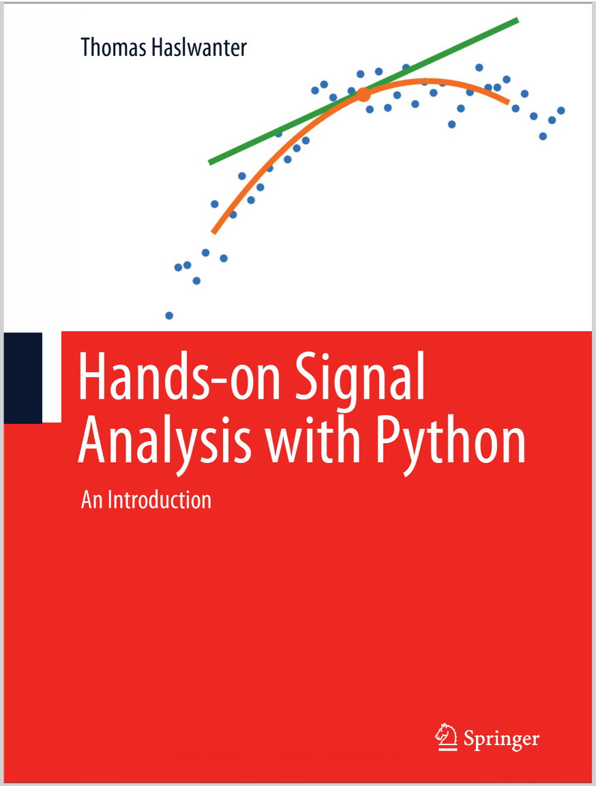

<!-- 
 -->
<!--    -->
<!-- 
 -->

---
Hands-on Signal Analysis with Python
---
Python code, data, and Jupyter notebooks, to the book
["Hands-on Signal Analysis with Python"](https://link.springer.com/book/10.1007/978-3-030-57903-6).

 

data
====
Raw data required for running the programs

ipynbs
======
Presentation of additional or extended information relevant to signal
processing with Python.

images
======
Images used by this repo

src
===
All the Python programs that go with the book:
- Code samples (also called *Quantlets*)
- Solutions for the Exercises in the book
- Code-listings, i.e. Python programs printed in the book
- Code to generate the Figures in the book

tests
=====
Rudimentary tests to ensure that the programs in 'src' are running.

Errata
======
The file [Errata.pdf](Errata.pdf) contains the a list of mistakes in the
manuscript, and the corresponding corrections.
