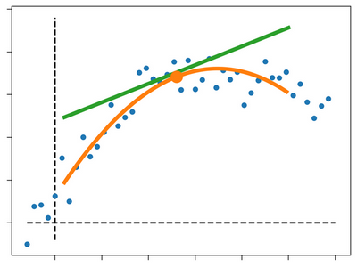

---
Hands-on Signal Analysis with Python
---
Python code and data to the manuscript "Hands-on Signal Analysis with Python"

data
====
Raw data required for running the programs

ipynbs
======
Presentation of additional or extended information relevant to signal
processing with Python.

images
======
Images used by this repo

src
===
All the Python programs that go with the book:
- Code samples (also called *Quantlets*)
- Solutions for the Exercises in the book
- Code-listings, i.e. Python programs printed in the book
- Code to generate the Figures in the book

tests
=====
Rudimentary tests to ensure that the programs in 'src' are running.
